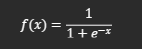
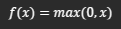
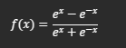
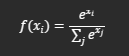
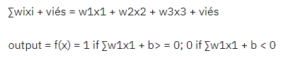

A Inteligência Artificial (IA) é um campo amplo que engloba várias abordagens, técnicas e conceitos. Abaixo estão alguns dos conceitos mais importantes relacionados à IA:

[SUMARIO]
[Tipos de IA](#type)
[Sessão dedicada e aprofundada sobre cada arquitetura](#arch)
[Formulas de cada conceito](#form)
[Simplificando a formula](#simple)
[Exemplos em código (Não funcionais, apenas representação)](#example)
[Metodos mais utilizados](#method)
[Arquiteturas e ativações detalhadas](#archandact)


[--------------]
**Tipos de IA:**
1. **Aprendizado de Máquina (Machine Learning - ML):**
   O Aprendizado de Máquina é uma subárea da IA que se concentra em desenvolver algoritmos e modelos que permitem aos computadores aprender a partir de dados. Existem três principais abordagens de ML:
   - **Aprendizado Supervisionado:** Os modelos são treinados em um conjunto de dados rotulados, onde cada exemplo possui uma entrada e uma saída esperada. O objetivo é fazer com que o modelo generalize para prever saídas corretas para novos dados não vistos.
   - **Aprendizado Não Supervisionado:** Os modelos são treinados em um conjunto de dados não rotulados e devem encontrar padrões e estruturas nos dados sem a orientação de rótulos.
   - **Aprendizado por Reforço:** O agente de aprendizado interage com um ambiente e é recompensado ou punido com base em suas ações. O objetivo é aprender a tomar ações que maximizem a recompensa ao longo do tempo.
   - ************************** 
   1. **Entradas e Pesos:**
      No Aprendizado de Máquina, os algoritmos de aprendizado são projetados para fazer previsões ou tomar decisões com base em um conjunto de informações de entrada. Essas informações de entrada são chamadas de "características" ou "variáveis" e são representadas como um vetor numérico. Por exemplo, se estivermos construindo um modelo para prever o preço de uma casa, as características poderiam incluir o número de quartos, a área total do terreno, a localização, entre outros.

      O modelo de aprendizado de máquina precisa de uma maneira de medir a importância de cada característica na tarefa de previsão. Isso é feito através dos "pesos". Cada característica é multiplicada por um peso associado antes de ser usada para fazer uma previsão. Os pesos controlam o grau em que cada característica afeta a saída do modelo. Durante o treinamento, o algoritmo de aprendizado ajusta os pesos para encontrar a melhor combinação que permite ao modelo fazer previsões precisas.

   2. **Função de Ativação:**
      A função de ativação é uma parte crucial dos modelos de aprendizado de máquina, especialmente em redes neurais. Ela é aplicada às saídas intermediárias ou finais dos neurônios (ou unidades) do modelo. O objetivo da função de ativação é introduzir não linearidades no modelo, permitindo que ele aprenda relações complexas e não-lineares entre as características de entrada e a saída.

      Um exemplo simples de função de ativação é a função degrau ("step function") que usamos no exemplo do Perceptron. Ela retorna um valor binário (1 ou -1) com base em um limiar (normalmente zero), onde todos os valores maiores ou iguais ao limiar são mapeados para 1 e todos os valores menores que o limiar são mapeados para -1. Existem muitas outras funções de ativação, como a função sigmoid, a função ReLU (Rectified Linear Unit), a função tanh (tangente hiperbólica) e outras, cada uma com suas próprias características e vantagens.

   3. **Treinamento:**
      O treinamento de um modelo de aprendizado de máquina envolve alimentar o algoritmo de aprendizado com um conjunto de dados conhecido como conjunto de treinamento. Cada exemplo no conjunto de treinamento consiste em uma entrada (características) e a saída correspondente (rótulo ou valor esperado).

      Durante o treinamento, o modelo faz previsões com base nas características de entrada e compara essas previsões com os rótulos conhecidos no conjunto de treinamento. O algoritmo de aprendizado ajusta os pesos (ou outros parâmetros) do modelo iterativamente para minimizar a diferença entre as previsões e os rótulos reais. Esse processo é chamado de "otimização" e é realizado usando técnicas como a descida do gradiente.

      O objetivo do treinamento é fazer com que o modelo generalize bem para novos dados não vistos, ou seja, fazer previsões precisas em dados que não foram usados durante o treinamento.

   4. **Limitações do Aprendizado de Máquina (ML):**
      Embora o Aprendizado de Máquina seja uma abordagem poderosa e versátil, ele também possui algumas limitações:

      Limitações de Dados: O desempenho dos modelos de ML depende em grande parte da qualidade e quantidade dos dados de treinamento disponíveis. Se os dados são escassos ou não representativos do problema real, o modelo pode não conseguir generalizar bem para novos dados.

      Interpretabilidade: Muitos modelos de ML, especialmente os mais complexos, são considerados "caixas pretas" porque suas decisões são difíceis de serem interpretadas por humanos. Isso pode ser um problema em aplicações críticas em que a explicação do processo de tomada de decisão é essencial.

      Overfitting e Underfitting: O overfitting ocorre quando o modelo se ajusta demais aos dados de treinamento, capturando ruído e detalhes irrelevantes. O underfitting, por sua vez, ocorre quando o modelo é muito simples para capturar os padrões nos dados. Ambos os casos podem levar a um desempenho ruim do modelo em dados não vistos.

      Tempo de Treinamento e Complexidade: Algoritmos de aprendizado de máquina complexos, como redes neurais profundas, podem exigir recursos computacionais significativos e um tempo de treinamento prolongado, especialmente em grandes conjuntos de dados.

      Extrapolando além dos dados: Os modelos de aprendizado de máquina podem não ser confiáveis quando usados para fazer previsões além do espaço de dados em que foram treinados. Isso é conhecido como a limitação da "extrapolação".


2. **Redes Neurais Artificiais (RNA):**
   As Redes Neurais Artificiais são modelos inspirados na estrutura e funcionamento do cérebro humano. Elas são compostas por camadas de neurônios interconectados, e cada conexão é associada a um peso. O treinamento da rede neural envolve ajustar esses pesos para que a rede possa realizar tarefas específicas, como classificação ou regressão.
   - **************************

   1. **Entradas e Pesos:**
      As Redes Neurais Artificiais (RNA) são modelos inspirados na estrutura e funcionamento do cérebro humano. Assim como os neurônios biológicos no cérebro recebem sinais de entrada de outros neurônios, as RNA recebem informações de entrada que são chamadas de "características" ou "atributos". Essas características são representadas como um vetor numérico e podem ser coisas como valores numéricos, imagens, texto ou qualquer outra forma de dado que pode ser convertida em números.

      Cada característica de entrada está associada a um peso na rede neural. Os pesos são parâmetros que controlam a importância de cada característica na tarefa que a rede neural está sendo treinada para resolver. Durante o treinamento, a rede ajusta esses pesos para encontrar a melhor combinação que permite ao modelo fazer previsões precisas. Os pesos são essenciais para que a rede neural possa aprender a partir dos dados e generalizar para fazer previsões em novos dados não vistos.

   2. **Função de Ativação:**
      A função de ativação é um elemento chave nas redes neurais. Ela é aplicada em cada neurônio ou unidade da rede após a combinação linear das entradas ponderadas pelos pesos. A função de ativação introduz não-linearidades na rede, permitindo que ela aprenda relações e padrões complexos nos dados. Sem a função de ativação, a rede neural seria apenas uma combinação linear de suas entradas, tornando-a incapaz de resolver problemas não-lineares.

      Existem várias funções de ativação utilizadas nas redes neurais, e a escolha da função pode impactar a capacidade do modelo de aprender e sua eficácia em diferentes tarefas. Algumas funções de ativação comuns incluem a função sigmoid, a função ReLU (Rectified Linear Unit), a função tanh (tangente hiperbólica) e outras. Cada função de ativação possui propriedades específicas que afetam a capacidade da rede de aprender representações dos dados e evitar problemas como o desaparecimento ou explosão do gradiente durante o treinamento.

   3. **Treinamento:**
      O treinamento de uma Rede Neural Artificial (RNA) envolve alimentar a rede com um conjunto de dados conhecido como conjunto de treinamento. Esse conjunto contém exemplos com entradas e as saídas desejadas ou rótulos correspondentes para cada entrada. O processo de treinamento da RNA é conhecido como "aprendizado supervisionado", pois a rede é supervisionada por rótulos conhecidos durante o processo de ajuste dos pesos.

      Durante o treinamento, a rede neural faz previsões para cada exemplo de entrada no conjunto de treinamento e compara suas previsões com os rótulos reais correspondentes. A diferença entre as previsões e os rótulos é quantificada através de uma função de custo (também chamada de função de perda ou função de erro). O objetivo do treinamento é minimizar essa função de custo, ajustando os pesos da rede para reduzir o erro nas previsões.

      O processo de otimização para ajustar os pesos da rede é realizado através de um algoritmo de otimização, como a descida do gradiente (gradient descent), que ajusta os pesos gradualmente, movendo-os na direção que leva a uma redução no erro da previsão.

   4. **Limitações das Redes Neurais Artificiais (RNA):**
      As Redes Neurais Artificiais (RNA) são poderosas e têm sido usadas em diversas aplicações com sucesso. No entanto, elas também possuem algumas limitações:

      - **Exigência de Dados e Tempo de Treinamento:** 
      Redes neurais profundas com muitas camadas podem exigir grandes  quantidades de dados de treinamento para alcançar um bom desempenho. Além disso, o treinamento de redes profundas pode ser computacionalmente intensivo e demorado.

      - **Sobreajuste (Overfitting):** 
      Redes neurais têm a capacidade de memorizar os dados de treinamento, o que pode levar ao sobreajuste. O sobreajuste ocorre quando a rede se torna muito específica para os dados de treinamento e não generaliza bem para novos dados.

      - **Interpretabilidade:** 
      Redes neurais profundas são frequentemente consideradas "caixas pretas", o que significa que a relação entre as características de entrada e a saída do modelo não é facilmente interpretável. Isso pode ser um problema em domínios onde a explicação do modelo é importante.

      - **Requer Ajuste de Hiperparâmetros:** 
      Redes neurais possuem diversos hiperparâmetros, como a arquitetura da rede, a taxa de aprendizado e a escolha da função de ativação. O ajuste adequado desses hiperparâmetros é necessário para obter um bom desempenho da rede, e isso pode exigir experimentação e conhecimento especializado.

      - **Dificuldade em Dados de Alta Dimensão:** 
      Redes neurais podem ter dificuldades em lidar com dados de alta dimensão, o que pode exigir técnicas de redução de dimensionalidade ou outros métodos para tornar o problema mais gerenciável.


3. **Redes Neurais Profundas (Deep Neural Networks - DNN):**
   São redes neurais com várias camadas intermediárias (conhecidas como camadas ocultas) entre a camada de entrada e a camada de saída. Essas redes permitem aprender representações hierárquicas dos dados, o que as torna poderosas para problemas complexos.
   - **************************
   1. **Entradas e Pesos:**
      Em Redes Neurais Profundas (DNN), também conhecidas como redes neurais de múltiplas camadas, as entradas são os dados que alimentam a rede. Cada camada da rede recebe as entradas e executa uma combinação linear das entradas ponderadas pelos pesos associados a cada conexão entre os neurônios.

      A rede neural é composta por neurônios organizados em camadas: camada de entrada, camadas intermediárias (camadas ocultas) e camada de saída. Os neurônios da camada de entrada recebem diretamente as características dos dados de entrada. Cada neurônio nas camadas intermediárias recebe informações da camada anterior e processa essas informações para extrair características mais abstratas dos dados. Finalmente, a camada de saída gera a previsão ou resultado final da rede.

      Os pesos são parâmetros ajustáveis associados a cada conexão entre os neurônios em todas as camadas. Eles representam a importância de cada entrada (ou característica) para a tomada de decisão da rede. O processo de treinamento da rede consiste em ajustar esses pesos de forma a minimizar o erro entre as previsões da rede e as saídas esperadas, permitindo que a rede neural generalize e faça previsões precisas em dados não vistos.

   2. **Função de Ativação:**
      A função de ativação é aplicada a cada neurônio na rede após a combinação linear das entradas ponderadas pelos pesos. Essa função é crucial para introduzir não-linearidades na rede, tornando-a capaz de aprender e modelar relações complexas nos dados.

      As funções de ativação mais comuns utilizadas em Redes Neurais Profundas são a função ReLU (Rectified Linear Unit), a função sigmoid e a função tanh (tangente hiperbólica). A função ReLU é amplamente usada por sua simplicidade e eficácia, retornando o valor de entrada se for positivo e zero caso contrário. A função sigmoid mapeia os valores para o intervalo entre 0 e 1, e a função tanh mapeia os valores para o intervalo entre -1 e 1. Cada função de ativação tem suas propriedades e é escolhida com base no domínio do problema e nas características dos dados.

      A função de ativação não apenas permite que a rede resolva problemas não-lineares, mas também torna a rede mais eficiente no treinamento, evitando problemas como o desaparecimento do gradiente durante o processo de ajuste dos pesos.

   3. **Treinamento:**
      O treinamento de Redes Neurais Profundas envolve alimentar a rede com um conjunto de dados de treinamento conhecido como conjunto de treinamento. Cada exemplo no conjunto de treinamento consiste em uma entrada (características) e a saída correspondente, que é a saída desejada para essa entrada.

      O processo de treinamento da DNN é um tipo de aprendizado supervisionado, onde a rede neural é ajustada iterativamente para reduzir o erro entre suas previsões e as saídas reais. O algoritmo de otimização mais comum usado durante o treinamento é a descida do gradiente (gradient descent) e suas variantes.

      A descida do gradiente ajusta os pesos da rede neural na direção que leva a uma redução no valor da função de custo (função que quantifica o erro das previsões em relação aos rótulos reais). O objetivo é encontrar os pesos que minimizam essa função de custo, permitindo que a rede neural faça previsões precisas em novos dados não vistos.

      O treinamento de uma DNN é uma tarefa complexa que requer poder computacional e um conjunto de dados significativo para evitar o sobreajuste e garantir que a rede generaliza bem para dados não vistos.

   4. **Limitações das Redes Neurais Profundas (DNN):**
      Embora as Redes Neurais Profundas tenham alcançado resultados impressionantes em diversas aplicações, elas também apresentam algumas limitações:

      - **Exigência de Dados e Tempo de Treinamento:** 
         Redes Neurais Profundas, especialmente aquelas com muitas camadas, requerem um grande conjunto de dados de treinamento para aprender representações abstratas dos dados e evitar o sobreajuste. Além disso, o treinamento de DNNs pode ser computacionalmente intensivo e demorado, especialmente em grandes conjuntos de dados.

      - **Sobreajuste (Overfitting):** 
         DNNs são propensas a sobreajuste, especialmente quando o conjunto de dados de treinamento é limitado. O sobreajuste ocorre quando a rede se ajusta demais aos dados de treinamento, memorizando os detalhes e ruídos específicos do conjunto de treinamento e, portanto, não generaliza bem para novos dados.

      - **Interpretabilidade:** 
         Redes Neurais Profundas são frequentemente consideradas "caixas pretas" devido à complexidade de seus pesos e conexões. Isso significa que, em muitos casos, é difícil entender exatamente como a rede neural chegou a uma determinada decisão ou previsão.

      - **Necessidade de Hiperparâmetros:** 
         DNNs possuem diversos hiperparâmetros, como o número de camadas, o número de neurônios em cada camada, a taxa de aprendizado e a escolha da função de ativação. A seleção adequada desses hiperparâmetros pode ser uma tarefa desafiadora e muitas vezes requer ajuste e experimentação.

      - **Dados Desbalanceados:** 
         DNNs podem ter dificuldade em lidar com conjuntos de dados desbalanceados, onde uma classe é muito mais frequente do que as outras. Isso pode levar a uma tendência da rede a prever a classe majoritária e ignorar as classes minoritárias.


4. **Processamento de Linguagem Natural (Natural Language Processing - NLP):**
   É uma área da IA que se concentra na interação entre humanos e máquinas usando linguagem natural. O NLP inclui tarefas como reconhecimento de fala, compreensão de texto, tradução automática, entre outras.
   - **************************
   1. **Entradas e Pesos:**
      No Processamento de Linguagem Natural (NLP), as entradas são textos e palavras que são alimentados aos modelos de processamento de linguagem. Esses textos são transformados em representações numéricas para que possam ser processados por algoritmos de aprendizado de máquina. Existem várias maneiras de representar o texto em formato numérico, como a codificação one-hot, representação vetorial com base em contagem de palavras (BOW - Bag of Words), word embeddings (como Word2Vec e GloVe), entre outras.

      Os modelos de NLP utilizam pesos associados a cada palavra ou representação numérica da palavra. Esses pesos são parâmetros ajustáveis que são aprendidos durante o treinamento do modelo. Os pesos controlam a importância de cada palavra ou representação na tarefa de processamento de linguagem em questão. Por exemplo, em modelos de classificação de texto, os pesos indicam quais palavras são mais relevantes para determinar a classe ou categoria correta de um texto.

   2. **Função de Ativação:**
      Em NLP, a função de ativação não é tão comumente utilizada como nas redes neurais convencionais. As redes neurais para tarefas de processamento de linguagem muitas vezes não têm camadas ocultas ou funções de ativação, pois a camada de saída geralmente usa uma função softmax para representar as probabilidades das classes ou palavras.

      A função softmax é frequentemente usada para converter as saídas finais da rede neural em uma distribuição de probabilidade sobre todas as possíveis classes ou palavras. Ela mapeia os valores de saída em valores entre 0 e 1, de forma que a soma de todas as probabilidades seja igual a 1. Isso permite que o modelo faça previsões com base nas probabilidades estimadas para cada classe ou palavra.

   3. **Treinamento:**
      O treinamento de modelos de Processamento de Linguagem Natural envolve alimentar o modelo com um conjunto de dados de treinamento contendo textos e as respectivas saídas esperadas (rótulos) para cada texto. O processo de treinamento é geralmente supervisionado, onde o modelo é ajustado para minimizar a diferença entre suas previsões e as saídas reais.

      O conjunto de dados de treinamento é pré-processado para representar o texto em formato numérico, como mencionado anteriormente. Durante o treinamento, o modelo ajusta os pesos de forma a otimizar uma função de custo (como a função de perda de entropia cruzada) que mede o erro entre as previsões do modelo e as saídas reais.

      A otimização dos pesos é realizada por meio de um algoritmo de otimização, como a descida do gradiente, que ajusta os pesos gradualmente na direção que leva a uma redução no valor da função de custo. O treinamento continua por várias iterações (épocas) até que o modelo alcance um bom desempenho e generalize bem para novos textos não vistos.

   4. **Limitações do Processamento de Linguagem Natural (NLP):**
      O Processamento de Linguagem Natural é uma área desafiadora da Inteligência Artificial com algumas limitações significativas:

      - **Ambiguidade Linguística:** 
         A linguagem natural é inerentemente ambígua, com várias palavras e sentenças tendo múltiplos significados. Isso pode dificultar a interpretação correta do texto e levar a erros de previsão.

      - **Conhecimento Contextual:** 
         Para entender corretamente o significado de um texto, é necessário ter conhecimento contextual. Modelos de NLP podem ter dificuldade em capturar informações contextuais complexas, especialmente quando o conhecimento requerido está fora do escopo do conjunto de treinamento.

      - **Generalização Limitada:** 
         Alguns modelos de NLP podem ter dificuldade em generalizar bem para diferentes domínios ou estilos de linguagem, especialmente se o conjunto de treinamento não for diversificado o suficiente.

      - **Grandes Conjuntos de Dados:** 
         Modelos de NLP, especialmente aqueles baseados em redes neurais profundas, geralmente requerem grandes conjuntos de dados para obter um bom desempenho. A coleta e rotulação de grandes quantidades de dados podem ser desafiadoras e dispendiosas.

      - **Desafios de Análise de Sentimentos:** 
         A análise de sentimentos em texto pode ser complexa, pois envolve a compreensão de emoções sutis e nuances na linguagem. Modelos de NLP podem ter dificuldade em capturar essas nuances e podem ser sensíveis a ambiguidades emocionais.

5. **Visão Computacional (Computer Vision):**
   É uma área da IA que permite aos computadores "verem" e interpretarem o mundo visual, processando imagens e vídeos. Isso inclui tarefas como detecção de objetos, reconhecimento facial, segmentação de imagens e muito mais.
   - ************************** 
   1. **Entradas e Pesos:**
      Na Visão Computacional, as entradas são imagens ou vídeos que são fornecidos aos modelos de processamento de imagem. Cada imagem é composta por pixels, e esses pixels são tratados como características individuais em algumas abordagens. No entanto, em muitos casos, as imagens são pré-processadas para extrair características mais significativas, como bordas, texturas ou características de alta ordem.

      Os modelos de Visão Computacional utilizam pesos associados a cada característica ou pixel da imagem. Esses pesos são parâmetros ajustáveis que são aprendidos durante o treinamento do modelo. Eles representam a importância de cada característica para a tarefa de visão computacional em questão. Por exemplo, em um modelo de classificação de imagens, os pesos indicam quais características ou partes da imagem são mais relevantes para determinar a classe correta.

      As redes neurais profundas são amplamente usadas em Visão Computacional e, nessas redes, os pesos também são associados a cada conexão entre os neurônios das camadas convolucionais. As camadas convolucionais são projetadas para extrair automaticamente características relevantes das imagens, e os pesos nessa camada determinam quais características são aprendidas durante o treinamento.

   2. **Função de Ativação:**
      A função de ativação é um elemento-chave nas redes neurais usadas em Visão Computacional, especialmente nas camadas convolucionais. As funções de ativação introduzem não-linearidades na rede, permitindo que ela aprenda relações complexas entre as características de entrada e a saída desejada.

      A função de ativação mais comumente usada em camadas convolucionais é a função ReLU (Rectified Linear Unit). Ela é definida como f(x) = max(0, x), onde x é o valor de entrada. A função ReLU retorna o valor de entrada se for positivo e zero caso contrário. A função ReLU é preferida por sua simplicidade computacional e sua capacidade de evitar problemas de desaparecimento do gradiente durante o treinamento, o que permite um treinamento mais estável e eficiente.

   3. **Treinamento:**
      O treinamento de modelos de Visão Computacional envolve alimentar o modelo com um conjunto de imagens ou vídeos conhecido como conjunto de treinamento. Cada exemplo no conjunto de treinamento consiste em uma imagem (entrada) e a classe ou categoria correspondente a essa imagem (rótulo).

      O processo de treinamento é supervisionado, onde o modelo é ajustado para minimizar o erro entre suas previsões e os rótulos reais. O erro é quantificado por meio de uma função de custo (ou função de perda), como a entropia cruzada, que mede a diferença entre as previsões do modelo e os rótulos reais.

      Durante o treinamento, os pesos do modelo são atualizados iterativamente usando um algoritmo de otimização, como a descida do gradiente. O algoritmo de otimização ajusta os pesos gradualmente na direção que leva a uma redução no valor da função de custo. O treinamento continua por várias iterações (épocas) até que o modelo alcance um bom desempenho e generalize bem para novas imagens ou vídeos não vistos.

   4. **Limitações da Visão Computacional:**
      A Visão Computacional é uma área complexa e desafiadora, com algumas limitações importantes:

      - **Variação de Iluminação e Ângulo:** 
         As imagens podem ter variações significativas de iluminação e ângulo, o que pode dificultar a identificação correta de objetos ou características.

      - **Oclusões e Ruídos:** 
         Oclusões (quando parte do objeto está oculta) e ruídos nas imagens podem interferir na detecção e no reconhecimento de objetos.

      - **Dificuldades com Objetos Pequenos ou Distantes:** 
         Objetos pequenos ou distantes podem ser difíceis de detectar ou reconhecer, especialmente em imagens com baixa resolução.

      - **Requer Grandes Conjuntos de Dados:** 
         Redes neurais profundas usadas em Visão Computacional geralmente requerem grandes conjuntos de dados para obter um bom desempenho. A coleta e rotulação de grandes quantidades de dados podem ser desafiadoras e dispendiosas.

      - **Interpretabilidade:** 
         Alguns modelos de Visão Computacional baseados em redes neurais profundas são considerados "caixas pretas", tornando difícil entender exatamente como a rede neural chegou a uma determinada previsão ou decisão.

      - **Limitações de Generalização:** 
         Modelos de Visão Computacional podem ter dificuldade em generalizar bem para diferentes domínios ou situações em que as imagens são diferentes das imagens de treinamento.


6. **IA Baseada em Regras (Expert Systems):**
   É uma abordagem tradicional de IA que utiliza um conjunto de regras lógicas para tomar decisões ou fornecer respostas com base em informações fornecidas pelos usuários.
   - ************************** 
   1. **Entradas e Pesos:**
      Nos Sistemas Especialistas ou IA Baseada em Regras, as entradas são informações ou dados fornecidos ao sistema. Esses dados geralmente representam o estado de um problema ou domínio específico. As entradas podem ser fornecidas pelo usuário ou por outras fontes de dados.

      Em contraste com muitas outras abordagens de IA, os Sistemas Especialistas não utilizam pesos associados às entradas. Em vez disso, eles se baseiam em um conjunto de regras pré-definidas que representam o conhecimento especializado do domínio em questão. Essas regras são criadas por especialistas humanos no domínio e expressam o raciocínio lógico ou causal usado para tomar decisões ou fazer inferências.

      As regras são escritas em uma linguagem de programação específica para a IA Baseada em Regras e consistem em condições (antecedentes) e ações (consequentes). Quando as condições de uma regra são atendidas pelas entradas, a ação correspondente é executada, levando a uma resposta ou tomada de decisão específica.

   2. **Função de Ativação:**
      A função de ativação não é um conceito relevante na IA Baseada em Regras. A abordagem não envolve a utilização de funções de ativação ou processamento de dados numéricos, como em redes neurais.

      No lugar disso, a abordagem se baseia em lógica simbólica e regras linguísticas. As regras são expressas em linguagem natural ou uma linguagem de programação de domínio específico, e o processo de tomada de decisão é conduzido seguindo a lógica definida pelas regras.

   3. **Treinamento:**
      Ao contrário de muitas técnicas de Aprendizado de Máquina, os Sistemas Especialistas não requerem um processo de treinamento com dados. As regras são criadas manualmente por especialistas humanos e, portanto, não há uma etapa de treinamento como em algoritmos de aprendizado supervisionado.

      O desenvolvimento de um Sistema Especialista envolve o conhecimento detalhado do domínio em questão e a habilidade de traduzir o conhecimento especializado em regras lógicas que podem ser interpretadas pelo sistema.

      Uma vez que as regras estão definidas, o sistema está pronto para receber entradas e executar as regras correspondentes para fazer inferências ou tomar decisões.

   4. **Limitações da IA Baseada em Regras (Sistemas Especialistas):**
      Embora os Sistemas Especialistas tenham sido amplamente utilizados em aplicações específicas, eles também possuem algumas limitações:

      - **Complexidade e Escalabilidade:** 
         A criação de regras para domínios complexos pode ser trabalhosa e exigir o conhecimento detalhado de especialistas. À medida que o domínio cresce em complexidade, a criação e manutenção das regras pode se tornar difícil e pouco escalável.

      - **Dificuldade de Lidar com Incerteza e Ambiguidade:** 
         A lógica simbólica utilizada nos Sistemas Especialistas não é adequada para lidar com incerteza ou ambiguidade, que são comuns em muitos domínios do mundo real.

      - **Dificuldade em Aprender e Adaptar:** 
         Os Sistemas Especialistas não têm capacidade de aprender automaticamente com novos dados ou experiências. Isso significa que, para atualizar ou aprimorar o conhecimento do sistema, é necessário envolvimento humano para modificar as regras existentes ou adicionar novas regras.

      - **Dependência de Especialistas Humanos:** 
         A eficácia de um Sistema Especialista depende do conhecimento e experiência dos especialistas humanos que criam as regras. Se os especialistas não têm uma compreensão completa do domínio, o sistema pode ter desempenho limitado.

      - **Dificuldade de Lidar com Conhecimento Tácito:** 
         Muitas vezes, o conhecimento dos especialistas é tácito ou difícil de ser formalizado em regras explícitas, o que pode limitar a capacidade do Sistema Especialista de abordar casos complexos.

7. **Sistemas de Recomendação (Recommendation Systems):**
   São algoritmos que recomendam produtos, conteúdos ou serviços aos usuários com base em suas preferências e comportamentos anteriores.
   - ************************** 
   1. **Entradas e Pesos:**
      Em Sistemas de Recomendação, as entradas são informações sobre os usuários e os itens que compõem o catálogo de produtos, serviços ou conteúdos. Por exemplo, em um sistema de recomendação de filmes, as entradas podem ser os perfis dos usuários (suas preferências, histórico de visualização, avaliações) e informações sobre os filmes (gênero, diretor, elenco, classificação).

      Os sistemas de recomendação não utilizam pesos associados às entradas, como em redes neurais ou outros modelos de aprendizado de máquina. Em vez disso, eles se baseiam em diferentes técnicas e algoritmos para identificar padrões e relações entre os usuários e itens. Esses algoritmos são projetados para fornecer recomendações personalizadas para cada usuário com base em suas preferências e histórico de interações.

   2. **Função de Ativação:**
      A função de ativação não é uma parte intrínseca dos Sistemas de Recomendação. Ao contrário das redes neurais, que utilizam funções de ativação para introduzir não-linearidades e modelar relações complexas nos dados, os Sistemas de Recomendação frequentemente se baseiam em abordagens matemáticas e estatísticas sem a necessidade de funções de ativação.

      As técnicas de recomendação variam amplamente e podem incluir abordagens baseadas em filtragem colaborativa, filtragem baseada em conteúdo, fatoração matricial, aprendizado por regras, entre outras. Essas técnicas exploram diferentes características e aspectos dos dados para fazer recomendações.

   3. **Treinamento:**
      O treinamento em Sistemas de Recomendação é um processo diferente em comparação com modelos de aprendizado de máquina tradicionais. Em vez de treinar o modelo com dados rotulados, como é comum em tarefas de classificação ou regressão, os Sistemas de Recomendação são treinados com dados de interações usuário-item.

      O processo de treinamento envolve a criação de um modelo que capture padrões a partir das interações existentes entre usuários e itens. Por exemplo, em filtragem colaborativa, o modelo busca aprender padrões de similaridade entre usuários ou itens com base em suas avaliações ou comportamentos de interação.

      Os Sistemas de Recomendação também podem fazer uso de técnicas de aprendizado não supervisionado, como fatoração matricial, para decompor os dados de interações em fatores latentes que representam características ocultas dos usuários e itens.

      Em algumas abordagens de recomendação, o modelo é iterativamente ajustado usando algoritmos de otimização para melhorar a precisão das recomendações com base nas avaliações e feedbacks dos usuários.

   4. **Limitações dos Sistemas de Recomendação:**
      Apesar de sua utilidade em várias aplicações, os Sistemas de Recomendação também apresentam algumas limitações:

      - **Problema do Filtro Bolha:** 
         Em alguns casos, os sistemas de recomendação podem criar um "filtro bolha", onde os usuários são expostos apenas a recomendações que se alinham com seus interesses atuais, limitando sua exposição a novas ideias e informações.

      - **Dificuldade com Novos Usuários e Itens:** 
         Quando um novo usuário se junta ao sistema ou um novo item é introduzido no catálogo, a falta de dados de interações pode tornar difícil fazer recomendações precisas para essas novas entradas.

      - **Escassez de Dados:** 
         Em alguns casos, pode haver escassez de dados de interações, especialmente para itens menos populares ou para usuários com comportamentos de interação limitados, o que pode afetar a precisão das recomendações.

      - **Viés de Recomendação:** 
         Algoritmos de recomendação podem exibir viés em suas recomendações, resultando em um foco excessivo em determinados tipos de itens ou uma segmentação limitada de usuários.

      - **Cold Start Problem:** 
         O problema do "Cold Start" ocorre quando o sistema de recomendação enfrenta dificuldades ao recomendar para novos usuários ou novos itens, já que não há informações suficientes para fazer recomendações personalizadas.

      - **Desafio de Diversidade:** 
         Em alguns casos, os sistemas de recomendação podem ter dificuldade em fornecer recomendações diversificadas, levando a uma falta de variedade nas opções apresentadas aos usuários.

8. **Redes Neurais Convolucionais (Convolutional Neural Networks - CNN):**
   São um tipo especializado de redes neurais projetadas para processar dados com estrutura de grade, como imagens e vídeos. Elas são amplamente usadas em visão computacional.
   - ************************** 
   1. **Entradas e Pesos:**
      Em Redes Neurais Convolucionais, as entradas são imagens ou dados bidimensionais, como mapas de calor, espectrogramas e outras representações visuais. As CNNs são projetadas para processar dados com estrutura espacial, tornando-as ideais para tarefas de visão computacional, onde a localização e as relações espaciais dos elementos são cruciais para a tomada de decisões.

      As CNNs utilizam pesos associados a cada filtro convolucional. Os filtros convolucionais são pequenas matrizes que deslizam sobre a imagem de entrada, realizando operações de convolução local em cada região. Cada filtro é uma matriz de números que representa padrões específicos que a CNN deve aprender a detectar nas imagens. Durante o treinamento, a rede ajusta esses pesos para aprender padrões significativos e características relevantes nas imagens que são relevantes para a tarefa em questão.

   2. **Função de Ativação:**
      A função de ativação é aplicada após a operação de convolução para introduzir não-linearidades na rede e torná-la capaz de aprender relações complexas entre as características da imagem. A função de ativação mais comumente utilizada em camadas convolucionais de CNNs é a função ReLU (Rectified Linear Unit).

      A função ReLU é definida como f(x) = max(0, x), onde x é o valor da entrada. Ela retorna o valor de entrada se for positivo e zero caso contrário. A função ReLU é preferida por sua simplicidade computacional e sua capacidade de evitar problemas de desaparecimento do gradiente, o que permite um treinamento mais estável e eficiente.

      Outras funções de ativação, como a função sigmoide e a função tanh (tangente hiperbólica), também podem ser usadas, mas a função ReLU é mais comum nas camadas convolucionais devido ao seu desempenho superior na prática.

   3. **Treinamento:**
      O treinamento das Redes Neurais Convolucionais envolve alimentar a rede com um conjunto de dados de treinamento contendo imagens e seus respectivos rótulos (classes ou categorias). O objetivo do treinamento é ajustar os pesos da rede de forma a minimizar o erro entre suas previsões e os rótulos reais.

      Durante o treinamento, a CNN usa a descida do gradiente (ou alguma variante) para ajustar os pesos. O algoritmo de descida do gradiente ajusta os pesos gradualmente na direção que leva a uma redução no valor da função de custo (ou função de perda), que quantifica o erro entre as previsões da rede e os rótulos reais.

      A CNN passa por várias iterações (épocas) de treinamento para ajustar progressivamente os pesos e melhorar o desempenho na tarefa. O treinamento de CNNs pode ser computacionalmente intensivo, especialmente em grandes conjuntos de dados, e geralmente requer GPUs ou TPUs para acelerar o processo.

   4. **Limitações das Redes Neurais Convolucionais (CNNs):**
      Apesar de serem altamente eficazes em várias tarefas de visão computacional, as CNNs também têm algumas limitações:

      - **Requerem Dados Rotulados:** 
         Assim como outras redes neurais, CNNs requerem um grande conjunto de dados de treinamento com rótulos para aprender representações eficazes. A criação manual desses conjuntos de dados rotulados pode ser demorada e dispendiosa.

      - **Requerem Grande Poder Computacional:** 
         O treinamento de CNNs, especialmente em arquiteturas profundas, pode ser computacionalmente intensivo e exigir hardware de alto desempenho, como GPUs ou TPUs.

      - **Suscetíveis ao Overfitting:** 
         Como outras redes neurais, CNNs podem ser suscetíveis ao overfitting, especialmente quando o conjunto de dados de treinamento é limitado. Estratégias de regularização, como dropout e aumento de dados (data augmentation), são comumente usadas para combater o overfitting.

      - **Desafios com Objetos Pequenos ou Ocluídos:** 
         Em imagens com objetos pequenos ou parcialmente ocluídos, as CNNs podem ter dificuldades para detectar e reconhecer corretamente esses objetos.

      - **Limitações de Generalização em Novos Domínios:** 
         CNNs podem ter dificuldade em generalizar bem para novos domínios ou cenários não vistos durante o treinamento, especialmente se os novos dados forem significativamente diferentes dos dados de treinamento.

      - **Limitações de Interpretabilidade:** 
         Em arquiteturas profundas, as representações aprendidas pelas camadas convolucionais podem ser difíceis de interpretar, tornando as CNNs "caixas pretas" em algumas situações.


9. **Redes Generativas Adversariais (Generative Adversarial Networks - GAN):**
   São redes neurais compostas por dois modelos: o gerador, que cria dados sintéticos, e o discriminador, que tenta distinguir entre dados reais e sintéticos. O treinamento dessas redes envolve uma competição entre esses dois modelos, tornando o gerador cada vez melhor em criar dados realistas.
   - ************************** 
   1. **Entradas e Pesos:**
      Em Redes Generativas Adversariais, as entradas são vetores de ruído aleatório (por exemplo, números aleatórios) que são fornecidos à rede geradora. Esses vetores de ruído são transformados pela rede geradora em amostras que se assemelham a dados reais (por exemplo, imagens, áudio, texto, etc.).

      A GAN consiste em duas redes neurais diferentes: a rede geradora (Generator) e a rede discriminadora (Discriminator). A rede geradora recebe os vetores de ruído como entrada e produz amostras geradas sinteticamente. A rede discriminadora, por sua vez, recebe tanto amostras reais quanto amostras geradas pela rede geradora como entrada e tenta distinguir entre elas, atribuindo uma probabilidade de ser uma amostra real.

      Os pesos da rede geradora e da rede discriminadora são ajustáveis durante o treinamento, e eles determinam a capacidade de ambas as redes em gerar amostras realistas e discernir entre amostras reais e falsas, respectivamente.

   2. **Função de Ativação:**
      As funções de ativação são elementos-chave nas camadas das redes neurais das GANs, tanto na rede geradora quanto na rede discriminadora. Elas são usadas para introduzir não-linearidades nas operações realizadas pelas redes.

      Em geral, funções de ativação não lineares como a função ReLU (Rectified Linear Unit) são usadas nas camadas ocultas das redes geradora e discriminadora. No entanto, nas camadas de saída da rede geradora, é comum utilizar funções de ativação como a função sigmoide ou a função tangente hiperbólica para garantir que as amostras geradas estejam no intervalo adequado (por exemplo, entre 0 e 1 para imagens em escala de cinza) e tenham a distribuição desejada.

   3. **Treinamento:**
      O treinamento das Redes Generativas Adversariais é um processo de competição entre a rede geradora e a rede discriminadora. A GAN é treinada em um esquema de dois passos:

      - **Passo 1: Treinamento do Discriminador:** 
         Nesta etapa, a rede discriminadora é treinada em um conjunto de dados contendo amostras reais e amostras geradas pela rede geradora. O objetivo do discriminador é aprender a distinguir entre as amostras reais e falsas. A rede discriminadora é atualizada para maximizar sua capacidade de classificar corretamente as amostras como reais ou falsas.

      - **Passo 2: Treinamento do Gerador:** 
         Nesta etapa, a rede geradora é treinada para enganar o discriminador, ou seja, produzir amostras geradas que o discriminador classifique erroneamente como amostras reais. O objetivo da rede geradora é minimizar a capacidade do discriminador de distinguir entre as amostras geradas e reais. A rede geradora é atualizada para maximizar sua capacidade de enganar o discriminador.

         Esses dois passos são repetidos em ciclos durante o treinamento, permitindo que a rede geradora melhore continuamente na geração de amostras realistas e a rede discriminadora aprimore sua capacidade de discernir entre amostras reais e falsas. O treinamento das GANs é considerado um processo adversarial porque as duas redes estão competindo e aprimorando suas habilidades opostas.

   4. **Limitações das Redes Generativas Adversariais (GANs):**
      As GANs são poderosas e têm sido utilizadas com sucesso em muitas aplicações, mas também têm algumas limitações:

      - **Treinamento Instável:** 
         O treinamento das GANs pode ser instável e desafiador, especialmente em arquiteturas profundas. É comum que as GANs apresentem dificuldades em encontrar o equilíbrio entre a rede geradora e a rede discriminadora.

      - **Modos Colapsados:** 
         As GANs podem enfrentar o problema de "modos colapsados", onde a rede geradora só consegue gerar algumas variações limitadas de amostras, não explorando adequadamente toda a distribuição dos dados reais.

      - **Avaliação Subjetiva:** 
         Avaliar a qualidade das amostras geradas por uma GAN pode ser subjetivo e desafiador, uma vez que não há uma medida única de sucesso.

      - **Generalização Limitada:** 
         GANs podem ter dificuldade em generalizar bem para domínios de dados que são diferentes dos dados de treinamento, resultando em amostras geradas que não são realistas em novas situações.

      - **Dificuldade com Dados Escassos:** 
         Treinar GANs com dados escassos pode ser um desafio, especialmente quando o espaço de características é complexo e multidimensional.

      - **Requerem Grande Conjunto de Dados:** 
         GANs geralmente requerem grandes conjuntos de dados para obter resultados satisfatórios, o que pode ser um obstáculo em cenários onde os dados são limitados ou difíceis de coletar.


[----------------]
***Sessão dedicada e aprofundada sobre cada arquitetura (O mais importante e direto)***[](#arch)
1. **Redes Multilayer Perceptron**
   Redes Multilayer Perceptron (MLP) são um tipo de arquitetura de rede neural artificial que consiste em várias camadas de neurônios, incluindo uma camada de entrada, uma ou mais camadas ocultas e uma camada de saída. Essa arquitetura é chamada de "multilayer" (multicamadas) porque inclui múltiplas camadas de neurônios interconectados. Vou explicar com mais detalhes:

   **Estrutura de uma MLP:**

   1. **Camada de Entrada:** Esta camada recebe os dados de entrada e geralmente consiste em neurônios correspondentes às características ou dimensões dos dados.

   2. **Camadas Ocultas:** Essas camadas estão localizadas entre a camada de entrada e a camada de saída. Cada camada oculta é composta por vários neurônios, e a quantidade de camadas ocultas varia de acordo com a complexidade do problema. Cada neurônio em uma camada oculta está conectado a todos os neurônios na camada anterior e na camada seguinte.

   3. **Camada de Saída:** Esta camada fornece os resultados finais da rede neural. O número de neurônios na camada de saída depende do tipo de tarefa que a rede está realizando. Por exemplo, para classificação binária, pode haver um neurônio de saída; para classificação multiclasse, pode haver vários neurônios.

   **Funcionamento de uma MLP:**

   Cada neurônio em uma camada oculta ou na camada de saída tem um valor de ativação associado a ele. O cálculo do valor de ativação de um neurônio envolve duas etapas principais:

   1. **Combinação Linear:** Os valores de ativação dos neurônios na camada anterior são ponderados pelos pesos associados às conexões entre os neurônios. Esses valores ponderados são somados juntamente com um termo de viés (bias).

   2. **Função de Ativação:** O resultado da combinação linear é passado através de uma função de ativação, que determina se o neurônio deve ser ativado ou não com base no valor calculado.

   **Funções de Ativação em MLP:**

   As funções de ativação desempenham um papel crucial no funcionamento das MLPs. As funções mais comuns usadas em camadas ocultas e na camada de saída incluem:

   - **ReLU (Rectified Linear Unit):** f(x) = max(0, x)
   - **Tangente Hiperbólica (tanh):** f(x) = (exp(x) - exp(-x)) / (exp(x) + exp(-x))
   - **Sigmoid:** f(x) = 1 / (1 + exp(-x))
   - **Softmax:** Usada na camada de saída para classificação multiclasse.

   **Treinamento de MLP:**

   O treinamento de uma MLP envolve a alimentação dos dados de treinamento na rede, cálculo das saídas, comparação com os resultados esperados e ajuste dos pesos e vieses usando algoritmos de otimização, como o Gradiente Descendente.

   As MLPs são versáteis e podem ser usadas para tarefas como classificação, regressão e aproximação de funções complexas. No entanto, para problemas mais complexos, como reconhecimento de imagem e processamento de linguagem natural, outras arquiteturas, como Redes Neurais Convolucionais (CNNs) e Redes Recorrentes (RNNs), são mais adequadas.


2. **Redes Neurais Convolucionais**
   Redes Neurais Convolucionais (Convolutional Neural Networks - CNNs) são um tipo especializado de arquitetura de rede neural projetada para processar dados que possuem uma estrutura de grade, como imagens e, mais amplamente, dados com arranjos espaciais, como sinais de áudio e séries temporais. As CNNs são especialmente eficazes na extração de recursos relevantes de dados multidimensionais, tornando-as uma escolha popular para tarefas de visão computacional e análise de dados sequenciais. Vamos mergulhar mais fundo nas CNNs:

   **Principais Características das CNNs:**

   1. **Camadas Convolucionais:** As camadas convolucionais são o coração das CNNs. Elas aplicam operações de convolução nos dados de entrada para extrair características relevantes. Essas características podem ser bordas, texturas, padrões e objetos em uma imagem.

   2. **Camadas de Pooling:** As camadas de pooling reduzem a dimensionalidade dos dados, preservando os recursos mais importantes. A operação de pooling mais comum é o max pooling, que seleciona o valor máximo de um grupo de valores próximos.

   3. **Camadas Totalmente Conectadas:** Após passar pelas camadas convolucionais e de pooling, os recursos são achatados e alimentados em camadas totalmente conectadas para tomada de decisões finais.

   4. **Uso de Funções de Ativação:** As funções de ativação, como ReLU, são aplicadas nas saídas das camadas convolucionais para introduzir não linearidade e permitir a aprendizagem de recursos mais complexos.

   **Vantagens das CNNs:**

   1. **Detecção Hierárquica de Recursos:** As camadas convolucionais são capazes de detectar recursos em diferentes níveis de abstração. Camadas iniciais detectam bordas e texturas, enquanto camadas posteriores podem identificar objetos complexos.

   2. **Invariância de Translação:** As CNNs são capazes de reconhecer recursos independentemente de sua posição na imagem, o que as torna robustas a variações de translação.

   3. **Redução de Parâmetros:** As camadas de pooling reduzem a dimensionalidade dos dados, permitindo que a rede capture características importantes com menos parâmetros.

   4. **Transferência de Aprendizado:** As CNNs pré-treinadas em grandes conjuntos de dados (como o ImageNet) podem ser usadas como ponto de partida para tarefas específicas, economizando tempo e recursos.

   **Exemplo de Aplicação: Reconhecimento de Imagens:**

   Uma aplicação comum das CNNs é o reconhecimento de imagens. Aqui está um fluxo geral de como as CNNs são usadas para essa tarefa:

   1. **Camadas Convolucionais:** As primeiras camadas convolucionais detectam bordas e padrões simples. Camadas posteriores detectam formas mais complexas e objetos.

   2. **Camadas de Pooling:** As camadas de pooling reduzem a dimensionalidade dos dados, mantendo características importantes.

   3. **Camadas Totalmente Conectadas:** Após passar pelas camadas convolucionais e de pooling, os recursos são achatados e alimentados em camadas totalmente conectadas.

   4. **Camada de Saída:** A camada de saída consiste em neurônios que representam classes possíveis. Softmax é frequentemente usada para converter as saídas em probabilidades.

   5. **Treinamento:** A rede é treinada com imagens rotuladas usando algoritmos de otimização, como o Gradiente Descendente.

   **Arquiteturas de CNNs Populares:**

   - **LeNet:** Uma das primeiras arquiteturas CNNs, projetada para reconhecimento de dígitos manuscritos.
   - **AlexNet:** Introduziu o uso de GPU para treinamento de redes profundas e obteve grande sucesso no desafio ImageNet.
   - **VGG:** Caracterizada por sua profundidade com camadas convolucionais e de pooling consecutivas.
   - **ResNet:** Introduziu o conceito de blocos residuais, facilitando o treinamento de redes profundas.
   - **Inception (GoogLeNet):** Utiliza múltiplas operações convolucionais em paralelo para capturar diferentes escalas de recursos.
   - **Xception:** Uma extensão do Inception que usa convoluções separáveis em profundidade.

3. **Redes Neurais Recorrentes**
   Redes Neurais Recorrentes (Recurrent Neural Networks - RNNs) são uma classe de arquiteturas de redes neurais projetadas para lidar com dados sequenciais ou temporais. Diferentemente das redes neurais tradicionais, as RNNs possuem conexões recorrentes, o que lhes permite manter informações sobre estados anteriores e usar essas informações para processar dados em sequência. Vamos explorar mais sobre as RNNs:

   **Principais Características das RNNs:**

   1. **Recorrência:** A principal característica das RNNs é sua capacidade de manter estados anteriores e usar esses estados para influenciar a saída atual. Isso é especialmente útil em dados sequenciais, onde a ordem importa.

   2. **Camadas Ocultas com Ciclo:** As RNNs têm camadas ocultas que são conectadas a si mesmas, criando um ciclo de retroalimentação que permite que as informações fluam entre diferentes etapas de tempo.

   3. **Compartilhamento de Pesos:** Ao longo do tempo, as mesmas conexões e pesos são reutilizados em cada etapa da sequência. Isso permite que as RNNs capturem dependências temporais e modelagem de sequência.

   **Desafios das RNNs:**

   As RNNs têm uma limitação conhecida como "problema do gradiente desvanecente" e "problema da explosão do gradiente". Isso ocorre quando os gradientes usados para ajustar os pesos da rede diminuem ou aumentam exponencialmente à medida que são propagados ao longo do tempo, dificultando o treinamento eficiente de sequências longas. Para superar esses desafios, surgiram variações das RNNs, como as LSTMs (Long Short-Term Memory) e GRUs (Gated Recurrent Units).

   **Variações das RNNs:**

   1. **LSTM (Long Short-Term Memory):** As LSTMs foram projetadas para capturar dependências de longo prazo em sequências. Elas têm unidades especiais chamadas "células de memória" que ajudam a manter informações ao longo de muitos passos de tempo.

   2. **GRU (Gated Recurrent Unit):** As GRUs também abordam o problema do gradiente desvanecente. Elas têm portas que controlam o fluxo de informações e memória através das etapas de tempo, permitindo que a rede aprenda quais informações reter e quais esquecer.

   **Aplicações das RNNs:**

   As RNNs são amplamente utilizadas em tarefas que envolvem sequências, como:

   - **Processamento de Linguagem Natural (NLP):** Tradução automática, geração de texto, análise de sentimentos, reconhecimento de fala.
   
   - **Previsão de Séries Temporais:** Previsão de vendas, preços de ações, previsão climática.

   - **Análise de Dados Sequenciais:** Reconhecimento de escrita à mão, análise de EEG, análise de DNA.

   **Arquiteturas Derivadas das RNNs:**

   1. **Redes Neurais de Memória de Curto Prazo (LSTM):** Adicionam unidades de memória de longo e curto prazo às RNNs, permitindo que aprendam e mantenham dependências temporais complexas.

   2. **Redes Neurais Bidirecionais (BiRNNs):** Processam sequências em ambas as direções (do início ao fim e do fim ao início), capturando informações contextuais de ambas as direções.

   3. **Redes Neurais de Memória de Longo Prazo (LSTM):** São uma variação das RNNs que contém unidades especiais de memória para capturar dependências de longo prazo.

4. **Long Short-Term Memory (LSTM)**
   Long Short-Term Memory (LSTM) é uma variação avançada das Redes Neurais Recorrentes (RNNs) projetada para lidar com a limitação das RNNs tradicionais de capturar dependências de longo prazo em sequências. As LSTMs foram desenvolvidas para solucionar o problema do desvanecimento e da explosão do gradiente, que ocorre quando as informações são propagadas por muitas etapas de tempo em RNNs convencionais. As LSTMs foram introduzidas para permitir que as redes aprendam relações temporais complexas e mantenham informações importantes em sequências de comprimento variável.

   **Principais Características das LSTMs:**

   1. **Células de Memória:** As LSTMs introduzem unidades especiais chamadas células de memória que podem armazenar informações durante várias etapas de tempo. Essas células de memória são projetadas para manter dependências de longo prazo.

   2. **Portas de Controle:** As LSTMs têm três portas principais: porta de entrada, porta de esquecimento e porta de saída. Essas portas controlam o fluxo de informações dentro da célula de memória e permitem que a LSTM aprenda quais informações reter e quais esquecer.

   3. **Gate de Esquecimento:** A porta de esquecimento decide qual parte da célula de memória deve ser atualizada ou esquecida. Isso ajuda a superar o problema do desvanecimento do gradiente, permitindo que informações relevantes sejam mantidas a longo prazo.

   4. **Gate de Entrada:** A porta de entrada decide quais novas informações devem ser adicionadas à célula de memória. Isso permite que a LSTM aprenda e incorpore novas informações importantes.

   5. **Gate de Saída:** A porta de saída controla a saída da célula de memória, decidindo qual parte da célula de memória será usada para calcular a saída atual.

   **Funcionamento de uma LSTM:**

   1. **Gate de Esquecimento:** Calcula qual parte da informação da célula de memória anterior deve ser esquecida, com base nas entradas atuais e no estado anterior.

   2. **Gate de Entrada:** Calcula quais novas informações devem ser adicionadas à célula de memória, considerando as entradas atuais e o estado anterior.

   3. **Atualização da Célula de Memória:** A célula de memória é atualizada com base nas decisões do gate de esquecimento e do gate de entrada.

   4. **Gate de Saída:** Calcula qual parte da célula de memória atual deve ser usada para calcular a saída atual.

   5. **Estado Atualizado:** O estado atualizado da célula de memória e a saída são usados para a próxima etapa de tempo e, assim, as informações são propagadas.

   **Aplicações das LSTMs:**

   As LSTMs são amplamente utilizadas em tarefas que envolvem dependências temporais complexas, como:

   - **Processamento de Linguagem Natural (NLP):** Tradução automática, geração de texto, análise de sentimentos, respostas de chatbots.
   
   - **Previsão de Séries Temporais:** Previsão de vendas, preços de ações, previsão climática.

   - **Análise de Sequências Biomédicas:** Sequências de DNA, análise de proteínas, diagnóstico médico.

   **Arquiteturas Derivadas das LSTMs:**

   1. **Redes Neurais de Memória de Longo Prazo (LSTM):** LSTMs aprimoradas para capturar dependências de longo prazo em sequências.

   2. **Redes Neurais Bidirecionais (BiLSTMs):** Extensão das LSTMs que processam sequências em ambas as direções, capturando informações contextuais de ambas as direções.

   3. **Redes Neurais de Memória de Curto Prazo (GRUs):** Variação das LSTMs com menos unidades de memória, mais simples e eficiente.

5. **Redes de Hopfield**
   As Redes de Hopfield são um tipo específico de rede neural recorrente que foi desenvolvida pelo cientista da computação John Hopfield em 1982. Essas redes são projetadas para armazenar e recuperar padrões de dados, sendo frequentemente utilizadas para resolver problemas de otimização e reconhecimento de padrões. As Redes de Hopfield têm algumas características distintas e são conhecidas por sua capacidade de funcionar como memórias associativas.

   **Características Principais das Redes de Hopfield:**

   1. **Modelo de Memória Associativa:** As Redes de Hopfield foram originalmente concebidas como modelos para armazenar e recuperar padrões de dados. Essas redes podem ser usadas para associar padrões de entrada com padrões de saída correspondentes.

   2. **Neurônios Binários:** Cada neurônio em uma Rede de Hopfield opera com um valor binário: +1 ou -1. Isso é diferente de muitas outras redes neurais, que usam valores contínuos.

   3. **Recorrência Simples:** As Redes de Hopfield são redes neurais recorrentes, o que significa que as saídas dos neurônios são retroalimentadas para as entradas. Essa retroalimentação permite que a rede iterativamente ajuste seus neurônios até alcançar um estado estável.

   4. **Função de Ativação Simples:** As Redes de Hopfield geralmente usam uma função de ativação simples chamada "função de degrau bipolar" que retorna +1 se a entrada for maior que um certo limiar e -1 caso contrário.

   5. **Atualização Síncrona:** Na maioria dos casos, as atualizações dos neurônios em uma Rede de Hopfield são síncronas, o que significa que todos os neurônios são atualizados ao mesmo tempo em cada iteração.

   **Funcionamento das Redes de Hopfield:**

   O processo de funcionamento das Redes de Hopfield é geralmente resumido em três passos:

   1. **Inicialização:** Os valores iniciais dos neurônios são definidos de acordo com os padrões que se deseja armazenar.

   2. **Atualização Iterativa:** A rede começa a iterar, atualizando os valores dos neurônios de acordo com suas entradas ponderadas e a função de ativação.

   3. **Estabilização:** A rede continua a iterar até que os valores dos neurônios não mudem mais ou até que atinja um estado onde os valores estão mais próximos dos padrões armazenados.

   **Aplicações das Redes de Hopfield:**

   As Redes de Hopfield têm várias aplicações, incluindo:

   - **Armazenamento e Recuperação de Padrões:** As redes podem ser usadas para armazenar padrões e, em seguida, recuperar padrões semelhantes, mesmo que tenham sido apresentados com ruído.

   - **Otimização Combinatória:** As Redes de Hopfield também são usadas para resolver problemas de otimização combinatória, onde é necessário encontrar uma configuração de variáveis que otimize uma determinada função objetivo.

   - **Processamento de Imagens:** Embora as Redes de Hopfield não sejam tão escaláveis para processamento de imagens de alta resolução, elas ainda podem ser usadas para denoising de imagens e restauração de padrões.

6. **Máquinas de Boltzmann**
   Máquinas de Boltzmann (Boltzmann Machines) são modelos probabilísticos e estocásticos que pertencem à família das redes neurais artificiais. Elas foram propostas pelo cientista Geoffrey Hinton e seus colaboradores em 1985. As Máquinas de Boltzmann são projetadas para modelar a distribuição conjunta de dados observados e são frequentemente usadas em tarefas de aprendizado não supervisionado, como redução de dimensionalidade, extração de características e geração de dados.

   **Características Principais das Máquinas de Boltzmann:**

   1. **Modelo Estocástico:** As Máquinas de Boltzmann são modeladas com base na teoria da mecânica estatística e probabilística. Elas operam com probabilidades e aleatoriedade.

   2. **Rede Neural Estocástica:** Cada unidade (neurônio) em uma Máquina de Boltzmann é considerada uma unidade estocástica, que gera valores de maneira probabilística.

   3. **Conexões Bidirecionais:** Diferentemente de outras redes neurais, as Máquinas de Boltzmann têm conexões totalmente conectadas, ou seja, cada unidade está conectada a todas as outras unidades.

   4. **Aprendizado Não Supervisionado:** As Máquinas de Boltzmann são frequentemente usadas para aprendizado não supervisionado, onde os dados de entrada são usados para ajustar os pesos da rede sem a necessidade de rótulos.

   **Tipos de Máquinas de Boltzmann:**

   1. **Máquinas de Boltzmann Restritas (RBM):** Uma RBM é uma versão simplificada da Máquina de Boltzmann original. Ela consiste em uma camada visível e uma camada oculta, e não há conexões entre as unidades dentro da mesma camada. RBMs são frequentemente usadas para redução de dimensionalidade, extração de características e colaboração filtragem.

   2. **Máquinas de Boltzmann Profundas (DBM):** As DBMs são extensões das RBMs que possuem várias camadas ocultas. Elas podem capturar representações mais complexas de dados e são usadas em aprendizado profundo.

   3. **Máquinas de Boltzmann Restritas de Temporização (RTRBM):** Essas máquinas estendem as RBMs para modelar sequências temporais e são úteis em tarefas de processamento de linguagem natural e análise de séries temporais.

   **Funcionamento das Máquinas de Boltzmann:**

   1. **Amostragem Estocástica:** Cada unidade em uma Máquina de Boltzmann possui um estado binário (ativo ou inativo). Os estados das unidades são amostrados estocasticamente com base em suas probabilidades calculadas.

   2. **Energia e Função de Partição:** As Máquinas de Boltzmann têm uma função de energia que representa a compatibilidade entre as unidades. A função de partição normaliza essas energias, convertendo-as em probabilidades.

   3. **Aprendizado:** O aprendizado em Máquinas de Boltzmann envolve ajustar os pesos para que os dados observados tenham maior probabilidade sob o modelo. Isso é geralmente feito por métodos de gradientes estocásticos, como o Contraste de Divergência (CD).

   **Aplicações das Máquinas de Boltzmann:**

   As Máquinas de Boltzmann têm várias aplicações, incluindo:

   - **Extração de Características:** Elas podem aprender representações de dados que são mais informativas e compactas, úteis para alimentar outras redes neurais.

   - **Redução de Dimensionalidade:** RBMs podem ser usadas para reduzir a dimensionalidade de dados, facilitando o processamento e visualização.

   - **Geração de Dados:** As Máquinas de Boltzmann podem gerar novos dados amostrando aleatoriamente a partir do modelo aprendido. Isso é útil para geração de imagens, texto e outros tipos de dados.

   **Limitações e Desafios:**

   Máquinas de Boltzmann têm algumas limitações, incluindo a dificuldade de treinamento em modelos mais profundos e a complexidade computacional do aprendizado. No entanto, suas variantes e combinações com outras arquiteturas (como Redes Neurais Profundas) tornaram essas técnicas mais eficazes e práticas.

7. **Deep Belief Network**   
   Deep Belief Networks (DBNs) são redes neurais profundas probabilísticas que consistem em múltiplas camadas de unidades estocásticas. Essas redes foram desenvolvidas por Geoffrey Hinton e sua equipe em 2006. As DBNs combinam as propriedades de Redes de Boltzmann Restritas (RBM) e Redes Neurais Profundas (DNNs) para criar modelos de aprendizado profundo que podem ser usados para tarefas de aprendizado não supervisionado e também para tarefas supervisionadas.

   **Características Principais das Deep Belief Networks:**

   1. **Arquitetura Profunda:** As DBNs têm várias camadas ocultas, permitindo que elas capturem representações hierárquicas complexas dos dados.

   2. **Camadas Restritas de Boltzmann:** Cada camada de uma DBN é composta por uma RBM restrita, uma variação simplificada das Máquinas de Boltzmann originais.

   3. **Aprendizado Não Supervisionado:** As DBNs são geralmente treinadas de maneira não supervisionada, usando um algoritmo de treinamento de contraste de divergência (CD) que ajusta os pesos das RBMs.

   4. **Pré-treinamento e Afinamento:** O treinamento de DBNs geralmente começa com o pré-treinamento de cada camada RBM. Posteriormente, as camadas são afinadas usando métodos supervisionados, como o gradiente descendente.

   **Funcionamento das Deep Belief Networks:**

   1. **Pré-treinamento das Camadas RBM:** Cada camada RBM é treinada isoladamente em uma abordagem não supervisionada. A saída de uma camada é usada como entrada para a próxima camada.

   2. **Transferência de Peso:** Após o treinamento das camadas RBM, os pesos e as ativações finais de cada camada são usados para inicializar a estrutura da DBN.

   3. **Afinamento:** Uma vez que a estrutura da DBN foi inicializada, todo o sistema é afinado em uma abordagem supervisionada, usando rótulos para ajustar os pesos da rede.

   **Aplicações das Deep Belief Networks:**

   As DBNs têm várias aplicações, incluindo:

   - **Classificação e Reconhecimento:** As DBNs podem ser usadas para tarefas de classificação, como reconhecimento de dígitos escritos à mão e reconhecimento de objetos em imagens.

   - **Geração de Dados:** Assim como outras redes gerativas, as DBNs podem ser usadas para gerar novos dados que se assemelham aos dados de treinamento.

   - **Extração de Características:** As camadas ocultas de uma DBN podem ser usadas para extrair características relevantes de dados de entrada, que podem ser posteriormente usadas para alimentar algoritmos de aprendizado de máquina.

   **Limitações e Desafios:**

   Embora as DBNs tenham demonstrado resultados promissores em várias tarefas, elas também apresentam desafios, como a complexidade computacional e a necessidade de um grande conjunto de dados para o treinamento eficaz. Além disso, a transição do treinamento não supervisionado para o treinamento supervisionado pode ser complicada e requer ajustes cuidadosos dos parâmetros. No entanto, as DBNs têm sido fundamentais no desenvolvimento de técnicas de aprendizado profundo e têm influenciado muitas outras arquiteturas, como as Redes Neurais Profundas Convencionais (DNNs) e Redes Neurais de Memória de Curto Prazo (LSTM).

8. **Deep Auto-Encoders**
   Deep Autoencoders, também conhecidos como Autoencoder Redes Neurais Profundas, são uma classe de redes neurais artificiais que visam aprender representações compactas e informativas dos dados de entrada. Eles pertencem à categoria de técnicas de aprendizado não supervisionado e são usados principalmente para tarefas de redução de dimensionalidade, extração de características e reconstrução de dados. Um autoencoder é uma rede que tenta aprender a representação latente (codificação) de seus próprios dados de entrada, com o objetivo de reconstruir esses dados o mais fielmente possível.

   **Principais Características dos Deep Autoencoders:**

   1. **Arquitetura Simétrica:** Um autoencoder é composto por duas partes principais: o encoder (codificador) e o decoder (decodificador). O encoder transforma os dados de entrada em uma representação latente de dimensionalidade menor, enquanto o decoder reconstrói os dados originais a partir dessa representação.

   2. **Camadas Profundas:** A principal característica que distingue os deep autoencoders é a presença de múltiplas camadas ocultas. Isso permite que eles capturem representações hierárquicas e complexas dos dados.

   3. **Treinamento Não Supervisionado:** Inicialmente, os deep autoencoders são treinados de maneira não supervisionada, sem a necessidade de rótulos de classe. Eles buscam minimizar a diferença entre os dados de entrada e suas reconstruções.

   **Funcionamento dos Deep Autoencoders:**

   1. **Encoder (Codificação):** O encoder recebe os dados de entrada e os transforma em uma representação latente de dimensionalidade menor. Cada camada oculta do encoder aplica uma transformação linear seguida de uma função de ativação.

   2. **Latent Representation (Representação Latente):** A representação latente é uma versão compacta dos dados originais, capturando as informações mais relevantes.

   3. **Decoder (Decodificação):** O decoder recebe a representação latente e tenta reconstruir os dados de entrada originais. Assim como o encoder, cada camada oculta do decoder aplica uma transformação linear seguida de uma função de ativação.

   4. **Função de Custo:** A função de custo usada para treinar os deep autoencoders é geralmente a diferença entre os dados de entrada originais e suas reconstruções. O objetivo é minimizar essa diferença.

   **Aplicações dos Deep Autoencoders:**

   Os deep autoencoders têm várias aplicações, incluindo:

   - **Redução de Dimensionalidade:** Eles podem ser usados para reduzir a dimensionalidade de dados, preservando ao mesmo tempo as informações mais relevantes. Isso é útil para visualização e para alimentar algoritmos de aprendizado de máquina.

   - **Extração de Características:** Os deep autoencoders podem aprender automaticamente as características mais relevantes dos dados, tornando-os úteis como uma etapa de pré-processamento para outras tarefas.

   - **Remoção de Ruído:** Eles podem ser usados para remover ruído de dados, treinando os autoencoders para reconstruir os dados originais a partir de versões ruidosas.

   - **Geração de Dados:** Com o treinamento adequado, os deep autoencoders podem gerar novos dados que se assemelham aos dados de treinamento.


[--------------------------------------]
**Formula matematica de cada conceito:**[](#form)
1. **Perceptron:**
   A saída de um perceptron é calculada como a soma ponderada das entradas mais o viés, seguida pela aplicação de uma função de ativação. A fórmula matemática do perceptron é:
   
   Saída (y) = Função_de_Ativação(Σ(entrada_i * peso_i) + viés)

2. **Função de Ativação - ReLU:**
   A função de ativação ReLU é definida como:
   
   f(x) = max(0, x)
   
   Onde x é a entrada. Se x for positivo, a função retorna x; caso contrário, retorna zero.

3. **Função de Ativação - Sigmoide:**
   A função de ativação sigmoide é definida como:
   
   f(x) = 1 / (1 + e^(-x))

   Onde e é a base do logaritmo natural (~2.71828) e x é a entrada. A função sigmoide mapeia qualquer valor real para um intervalo entre 0 e 1.

4. **Função de Ativação - Tangente Hiperbólica (tanh):**
   A função de ativação tangente hiperbólica é definida como:
   
   f(x) = (e^x - e^(-x)) / (e^x + e^(-x))

   Onde e é a base do logaritmo natural (~2.71828) e x é a entrada. A função tangente hiperbólica mapeia qualquer valor real para um intervalo entre -1 e 1.

5. **Redes Neurais Convolucionais (CNNs):**
   A saída de uma camada convolucional de uma CNN é calculada aplicando um filtro convolucional sobre a entrada, seguido pela aplicação de uma função de ativação. A fórmula matemática básica para uma operação de convolução 2D é:
   
   Saída(i, j) = Função_de_Ativação(Σ(filtro(m, n) * entrada(i + m, j + n)) + viés)

6. **Redes Generativas Adversariais (GANs):**
   O treinamento adversarial das GANs envolve a otimização de duas redes neurais: a geradora (G) e a discriminadora (D). A fórmula geral para o treinamento das GANs não é simplesmente expressa por uma única equação matemática, pois envolve várias etapas de otimização e cálculos de perda.

   A ideia geral é que a rede geradora tenta maximizar a probabilidade de que o discriminador classifique suas amostras como reais, enquanto o discriminador tenta corretamente classificar amostras reais e falsas. Isso cria um equilíbrio competitivo entre as duas redes, levando a uma geração de amostras mais realistas ao longo do treinamento.

[-----------------------------------------------]
**Simplificando a formula de maneira detalhada:**[](#simple)
1. **Perceptron:**
   Imagine um perceptron com três entradas (x1, x2, x3), três pesos (w1, w2, w3), e um viés (b). A saída (y) do perceptron é calculada da seguinte forma:

   - Multiplicamos cada entrada pelo seu peso correspondente: x1 * w1 + x2 * w2 + x3 * w3.
   - Somamos esses valores ponderados: Σ(xi * wi).
   - Adicionamos o viés: Σ(xi * wi) + b.
   - Aplicamos uma função de ativação (por exemplo, ReLU): y = Função_ReLU(Σ(xi * wi) + b).

2. **Função de Ativação - ReLU:**
   A função ReLU é muito simples. Dada uma entrada x, ela retorna x se x for positivo ou zero se x for negativo. Por exemplo:
   
   - Se x = 2, f(x) = 2.
   - Se x = -1, f(x) = 0.

3. **Função de Ativação - Sigmoide:**
   A função sigmoide mapeia qualquer valor x para um valor entre 0 e 1. A fórmula é:
   
   f(x) = 1 / (1 + e^(-x))
   
   Onde "e" é a base do logaritmo natural (~2.71828). Quanto maior o valor de x, mais próximo f(x) estará de 1. Quanto menor o valor de x, mais próximo f(x) estará de 0.

4. **Função de Ativação - Tangente Hiperbólica (tanh):**
   A função tangente hiperbólica é semelhante à sigmoide, mas mapeia valores para o intervalo entre -1 e 1. A fórmula é:
   
   f(x) = (e^x - e^(-x)) / (e^x + e^(-x))
   
   Se x for positivo, f(x) será próximo de 1. Se x for negativo, f(x) será próximo de -1.

5. **Redes Neurais Convolucionais (CNNs):**
   Para uma camada convolucional em uma CNN, vamos considerar uma matriz de entrada 5x5 e um filtro 3x3. A operação de convolução seria:

   - Posicione o filtro na matriz de entrada e faça a multiplicação elemento a elemento.
   - Some os produtos obtidos.
   - Adicione um valor de viés.
   - Aplique uma função de ativação (por exemplo, ReLU) ao resultado.

6. **Redes Generativas Adversariais (GANs):**
   O treinamento adversarial das GANs envolve otimizar duas redes, mas os cálculos são complexos e não podem ser resumidos em uma única fórmula. No entanto, de maneira geral:

   - A rede geradora gera uma amostra usando um vetor de ruído.
   - A rede discriminadora calcula a probabilidade de que a amostra seja real ou falsa.
   - A perda é calculada com base nas diferenças entre as previsões do discriminador e os valores reais.
   - Os pesos das redes são atualizados usando um algoritmo de otimização, como descida de gradiente.
   - O processo é repetido em ciclos até que a rede geradora crie amostras indistinguíveis das reais.

[-------------------]
**Exemplo em código**[](#example)
1. **Perceptron - Operação OR:**
   ```javascript
   // Definindo a função de ativação (degrau)
   function stepFunction(sum) {
   return sum >= 0 ? 1 : 0;
   }

   // Classe do Perceptron
   class Perceptron {
   constructor(numInputs) {
      // Inicializando pesos aleatórios para as entradas e um viés
      this.weights = new Array(numInputs);
      for (let i = 0; i < numInputs; i++) {
         this.weights[i] = Math.random() * 2 - 1; // Valores entre -1 e 1
      }
      this.bias = Math.random() * 2 - 1;

      // Taxa de aprendizado
      this.learningRate = 0.1;
   }

   // Função para calcular a saída do perceptron
   feedforward(inputs) {
      let sum = 0;
      // Calculando a soma ponderada das entradas e pesos
      for (let i = 0; i < this.weights.length; i++) {
         sum += inputs[i] * this.weights[i];
      }
      // Adicionando o viés
      sum += this.bias;
      // Aplicando a função de ativação (degrau)
      return stepFunction(sum);
   }

   // Treinamento do perceptron
   train(inputs, target) {
      // Calculando a saída atual do perceptron
      const guess = this.feedforward(inputs);
      // Calculando o erro (diferença entre a saída atual e o valor desejado)
      const error = target - guess;
      
      // Atualizando pesos das entradas
      for (let i = 0; i < this.weights.length; i++) {
         this.weights[i] += this.learningRate * error * inputs[i];
      }
      // Atualizando o viés
      this.bias += this.learningRate * error;
   }
   }

   // Criando um perceptron com 2 entradas
   const perceptron = new Perceptron(2);

   // Dados de treinamento (entradas e saídas desejadas)
   const trainingData = [
   { inputs: [0, 0], target: 0 },
   { inputs: [0, 1], target: 1 },
   { inputs: [1, 0], target: 1 },
   { inputs: [1, 1], target: 1 }
   ];

   // Treinando o perceptron
   for (let i = 0; i < 10000; i++) {
   for (const data of trainingData) {
      perceptron.train(data.inputs, data.target);
   }
   }

   // Testando o perceptron após o treinamento
   console.log(perceptron.feedforward([0, 0])); // Saída esperada: 0
   console.log(perceptron.feedforward([0, 1])); // Saída esperada: 1
   console.log(perceptron.feedforward([1, 0])); // Saída esperada: 1
   console.log(perceptron.feedforward([1, 1])); // Saída esperada: 1
   ```

   Neste exemplo, implementamos um Perceptron que pode aprender a função lógica OR. O Perceptron recebe duas entradas binárias e tenta prever o resultado da operação OR. O treinamento é realizado ajustando os pesos das entradas e o viés com base no erro entre a saída atual e a saída desejada. Depois do treinamento, testamos o Perceptron para verificar se ele consegue corretamente prever a operação OR para diferentes combinações de entradas.

2. **ReLU:**
   ```javascript
   // Função de ativação ReLU
   function relu(x) {
   return Math.max(0, x);
   }

   // Classe para criar um Perceptron com função de ativação ReLU
   class ReLUPerceptron {
   constructor(inputSize) {
      this.inputSize = inputSize;

      // Inicialização dos pesos e bias
      this.weights = new Array(inputSize);
      for (let i = 0; i < inputSize; i++) {
         this.weights[i] = Math.random() * 2 - 1; // Valores entre -1 e 1
      }
      this.bias = Math.random() * 2 - 1;
   }

   // Função de previsão (feedforward)
   predict(inputs) {
      let sum = 0;
      for (let i = 0; i < this.inputSize; i++) {
         sum += inputs[i] * this.weights[i];
      }
      return relu(sum + this.bias);
   }

   // Treinamento usando o algoritmo de descida do gradiente
   train(inputs, target, learningRate = 0.1, epochs = 1000) {
      for (let epoch = 0; epoch < epochs; epoch++) {
         // Cálculo da saída prevista
         const prediction = this.predict(inputs);

         // Cálculo do erro
         const error = target - prediction;

         // Atualização dos pesos e bias usando o gradiente
         for (let i = 0; i < this.inputSize; i++) {
         this.weights[i] += learningRate * error * inputs[i];
         }
         this.bias += learningRate * error;
      }
   }
   }

   // Dados de treinamento
   const trainingData = [
   { input: [0.1], target: 0.2 },
   { input: [0.2], target: 0.4 },
   { input: [0.3], target: 0.6 },
   { input: [0.4], target: 0.8 }
   ];

   // Criando um Perceptron com ReLU
   const perceptron = new ReLUPerceptron(1);

   // Treinando o Perceptron
   for (const data of trainingData) {
   perceptron.train(data.input, data.target);
   }

   // Testando o Perceptron treinado
   console.log(perceptron.predict([0.25])); // Saída esperada: próxima de 0.5
   ```

   Neste código, temos uma classe `ReLUPerceptron` que cria um Perceptron com a função de ativação ReLU. O método `predict` calcula a saída prevista do Perceptron para um conjunto de entradas, e o método `train` realiza o treinamento usando o algoritmo de descida do gradiente para ajustar os pesos e o bias.

3. **Sigmoide:**
   ```javascript
   // Função de ativação sigmoide
   function sigmoid(x) {
   return 1 / (1 + Math.exp(-x));
   }

   // Derivada da função de ativação sigmoide
   function sigmoidDerivative(x) {
   const sigmoidX = sigmoid(x);
   return sigmoidX * (1 - sigmoidX);
   }

   // Classe para criar uma Rede Neural com uma camada oculta
   class NeuralNetwork {
   constructor(inputSize, hiddenSize, outputSize) {
      this.inputSize = inputSize;
      this.hiddenSize = hiddenSize;
      this.outputSize = outputSize;

      // Inicializando pesos e vieses
      this.weightsInputHidden = this.randomWeights(inputSize, hiddenSize);
      this.biasHidden = this.randomBias(hiddenSize);
      this.weightsHiddenOutput = this.randomWeights(hiddenSize, outputSize);
      this.biasOutput = this.randomBias(outputSize);

      // Taxa de aprendizado
      this.learningRate = 0.1;
   }

   // Inicialização de valores aleatórios para os pesos e vieses
   randomWeights(rows, cols) {
      const weights = new Array(rows);
      for (let i = 0; i < rows; i++) {
         weights[i] = new Array(cols);
         for (let j = 0; j < cols; j++) {
         weights[i][j] = Math.random() * 2 - 1; // Valores entre -1 e 1
         }
      }
      return weights;
   }

   randomBias(size) {
      const bias = new Array(size);
      for (let i = 0; i < size; i++) {
         bias[i] = Math.random() * 2 - 1; // Valores entre -1 e 1
      }
      return bias;
   }

   // Função para calcular a saída da rede neural
   predict(input) {
      // Calculando saída da camada oculta
      const hiddenOutput = new Array(this.hiddenSize);
      for (let i = 0; i < this.hiddenSize; i++) {
         let sum = 0;
         for (let j = 0; j < this.inputSize; j++) {
         sum += input[j] * this.weightsInputHidden[j][i];
         }
         hiddenOutput[i] = sigmoid(sum + this.biasHidden[i]);
      }

      // Calculando saída da camada de saída
      const output = new Array(this.outputSize);
      for (let i = 0; i < this.outputSize; i++) {
         let sum = 0;
         for (let j = 0; j < this.hiddenSize; j++) {
         sum += hiddenOutput[j] * this.weightsHiddenOutput[j][i];
         }
         output[i] = sigmoid(sum + this.biasOutput[i]);
      }

      return output;
   }

   // Treinamento da rede neural usando retropropagação
   train(inputs, target) {
      // Calculando saída da camada oculta
      const hiddenOutput = new Array(this.hiddenSize);
      for (let i = 0; i < this.hiddenSize; i++) {
         let sum = 0;
         for (let j = 0; j < this.inputSize; j++) {
         sum += inputs[j] * this.weightsInputHidden[j][i];
         }
         hiddenOutput[i] = sigmoid(sum + this.biasHidden[i]);
      }

      // Calculando saída da camada de saída
      const output = new Array(this.outputSize);
      for (let i = 0; i < this.outputSize; i++) {
         let sum = 0;
         for (let j = 0; j < this.hiddenSize; j++) {
         sum += hiddenOutput[j] * this.weightsHiddenOutput[j][i];
         }
         output[i] = sigmoid(sum + this.biasOutput[i]);
      }

      // Calculando erro na camada de saída
      const outputError = new Array(this.outputSize);
      for (let i = 0; i < this.outputSize; i++) {
         outputError[i] = target[i] - output[i];
      }

      // Calculando gradientes na camada de saída
      const outputGradients = new Array(this.outputSize);
      for (let i = 0; i < this.outputSize; i++) {
         outputGradients[i] = outputError[i] * sigmoidDerivative(output[i]);
      }

      // Atualizando pesos e vieses na camada de saída
      for (let i = 0; i < this.hiddenSize; i++) {
         for (let j = 0; j < this.outputSize; j++) {
         this.weightsHiddenOutput[i][j] += this.learningRate * hiddenOutput[i] * outputGradients[j];
         }
      }

      for (let i = 0; i < this.outputSize; i++) {
         this.biasOutput[i] += this.learningRate * outputGradients[i];
      }

      // Calculando erro na camada oculta
      const hiddenError = new Array(this.hiddenSize);
      for (let i = 0; i < this.hiddenSize; i++) {
         hiddenError[i] = 0;
         for (let j = 0; j < this.outputSize; j++) {
         hiddenError[i] += outputGradients[j] * this.weightsHiddenOutput[i][j];
         }
      }

      // Calculando gradient

   es na camada oculta
      const hiddenGradients = new Array(this.hiddenSize);
      for (let i = 0; i < this.hiddenSize; i++) {
         hiddenGradients[i] = hiddenError[i] * sigmoidDerivative(hiddenOutput[i]);
      }

      // Atualizando pesos e vieses na camada oculta
      for (let i = 0; i < this.inputSize; i++) {
         for (let j = 0; j < this.hiddenSize; j++) {
         this.weightsInputHidden[i][j] += this.learningRate * inputs[i] * hiddenGradients[j];
         }
      }

      for (let i = 0; i < this.hiddenSize; i++) {
         this.biasHidden[i] += this.learningRate * hiddenGradients[i];
      }
   }
   }

   // Dados de treinamento (entradas e saídas desejadas)
   const trainingData = [
   { input: [0, 0], target: [0] },
   { input: [0, 1], target: [1] },
   { input: [1, 0], target: [1] },
   { input: [1, 1], target: [0] }
   ];

   // Criando uma rede neural com uma camada oculta
   const nn = new NeuralNetwork(2, 4, 1);

   // Treinando a rede neural
   const epochs = 10000;
   for (let epoch = 0; epoch < epochs; epoch++) {
   for (const data of trainingData) {
      nn.train(data.input, data.target);
   }
   }

   // Testando a rede neural treinada
   console.log(nn.predict([0, 0])); // Saída esperada: próxima de 0
   console.log(nn.predict([0, 1])); // Saída esperada: próxima de 1
   console.log(nn.predict([1, 0])); // Saída esperada: próxima de 1
   console.log(nn.predict([1, 1])); // Saída esperada: próxima de 0
   ```
   **1. Função de Ativação Sigmóide (`sigmoid`):**
   A função de ativação sigmóide é uma função que mapeia qualquer valor real para um intervalo entre 0 e 1. Isso é útil para introduzir não-linearidade em redes neurais. No código, a função `sigmoid` é usada para calcular a ativação das camadas oculta e de saída.

   **2. Derivada da Função de Ativação Sigmóide (`sigmoidDerivative`):**
   A derivada da função sigmóide é usada durante o cálculo dos gradientes para atualizar os pesos da rede durante o treinamento. Ela é fundamental para a retropropagação dos erros.

   **3. Classe `NeuralNetwork`:**
   Essa classe é a representação da rede neural. Ela é inicializada com o tamanho das camadas de entrada, oculta e de saída, juntamente com os pesos e vieses iniciais aleatórios.

   **4. Inicialização de Pesos e Vieses Aleatórios:**
   Os pesos são os valores que determinam a força da conexão entre neurônios. Os vieses são valores adicionados aos neurônios para controlar o limiar de ativação. Eles são inicializados aleatoriamente no intervalo entre -1 e 1.

   **5. Função `predict(input)`:**
   Essa função calcula a saída da rede neural para um dado conjunto de entradas. Primeiro, ela calcula a saída da camada oculta usando os pesos e vieses da primeira camada. Em seguida, calcula a saída final da rede usando a saída da camada oculta e os pesos e vieses da segunda camada.

   **6. Treinamento da Rede Neural usando Retropropagação:**
   Aqui é onde ocorre o treinamento da rede neural usando o algoritmo de retropropagação. A ideia básica é calcular os erros entre as saídas reais e as saídas previstas da rede, e então propagar esses erros de volta para ajustar os pesos e vieses.

   - Primeiro, calculamos a saída da camada oculta e de saída usando os pesos e vieses atuais.
   - Calculamos os erros nas saídas da camada de saída usando a diferença entre as saídas desejadas e as saídas previstas.
   - Calculamos os gradientes dos neurônios na camada de saída multiplicando os erros pelas derivadas da função de ativação.
   - Atualizamos os pesos e vieses da camada de saída usando os gradientes calculados e a taxa de aprendizado.
   - Propagamos os erros da camada de saída para a camada oculta, calculamos os gradientes dos neurônios na camada oculta e atualizamos os pesos e vieses da camada oculta da mesma forma.

   **7. Loop de Treinamento:**
   O treinamento ocorre por um certo número de épocas (iterações). Para cada época, percorremos os dados de treinamento e atualizamos os pesos e vieses da rede neural usando a função `train`.

   **8. Teste da Rede Neural Treinada:**
   Após o treinamento, testamos a rede neural treinada usando conjuntos de entrada para verificar se ela produz saídas próximas às saídas desejadas.

4. **Tangente Hiperbólica (tanh):**
   ```javascript
   // Função de ativação Tangente Hiperbólica (tanh)
   function tanh(x) {
   const eToX = Math.exp(x);
   const eToMinusX = Math.exp(-x);
   return (eToX - eToMinusX) / (eToX + eToMinusX);
   }

   // Classe para criar um Perceptron com função de ativação Tangente Hiperbólica (tanh)
   class TanhPerceptron {
   constructor(inputSize) {
      this.inputSize = inputSize;

      // Inicialização dos pesos e bias
      this.weights = new Array(inputSize);
      for (let i = 0; i < inputSize; i++) {
         this.weights[i] = Math.random() * 2 - 1; // Valores entre -1 e 1
      }
      this.bias = Math.random() * 2 - 1;
   }

   // Função de previsão (feedforward)
   predict(inputs) {
      let sum = 0;
      for (let i = 0; i < this.inputSize; i++) {
         sum += inputs[i] * this.weights[i];
      }
      return tanh(sum + this.bias);
   }

   // Treinamento usando o algoritmo de descida do gradiente
   train(inputs, target, learningRate = 0.1, epochs = 1000) {
      for (let epoch = 0; epoch < epochs; epoch++) {
         // Cálculo da saída prevista
         const prediction = this.predict(inputs);

         // Cálculo do erro
         const error = target - prediction;

         // Atualização dos pesos e bias usando o gradiente
         for (let i = 0; i < this.inputSize; i++) {
         this.weights[i] += learningRate * error * inputs[i];
         }
         this.bias += learningRate * error;
      }
   }
   }

   // Dados de treinamento
   const trainingData = [
   { input: [0.1], target: 0.2 },
   { input: [0.2], target: 0.4 },
   { input: [0.3], target: 0.6 },
   { input: [0.4], target: 0.8 }
   ];

   // Criando um Perceptron com Tangente Hiperbólica
   const perceptron = new TanhPerceptron(1);

   // Treinando o Perceptron
   for (const data of trainingData) {
   perceptron.train(data.input, data.target);
   }

   // Testando o Perceptron treinado
   console.log(perceptron.predict([0.25])); // Saída esperada: próxima de 0.5
   ```

   Neste código, é criada a classe `TanhPerceptron`, que cria um Perceptron com a função de ativação Tangente Hiperbólica (tanh). O método `predict` calcula a saída prevista do Perceptron para um conjunto de entradas, e o método `train` realiza o treinamento usando o algoritmo de descida do gradiente para ajustar os pesos e o bias.

5. **Redes Neurais Convolucionais (CNNs):**
   ```javascript
   // Função de ativação ReLU
   function relu(x) {
   return Math.max(0, x);
   }

   // Classe para definir uma camada convolucional
   class ConvolutionalLayer {
   constructor(filterSize, numFilters) {
      this.filterSize = filterSize;
      this.numFilters = numFilters;
      this.filters = [];

      for (let i = 0; i < numFilters; i++) {
         const filter = [];
         for (let j = 0; j < filterSize; j++) {
         filter.push([]);
         for (let k = 0; k < filterSize; k++) {
            filter[j].push(Math.random() - 0.5); // Valores aleatórios entre -0.5 e 0.5
         }
         }
         this.filters.push(filter);
      }
   }

   apply(input) {
      const outputSize = input.length - this.filterSize + 1;
      const output = [];

      for (let i = 0; i < outputSize; i++) {
         output.push([]);
         for (let j = 0; j < outputSize; j++) {
         let sum = 0;
         for (let k = 0; k < this.numFilters; k++) {
            for (let l = 0; l < this.filterSize; l++) {
               for (let m = 0; m < this.filterSize; m++) {
               sum += input[i + l][j + m] * this.filters[k][l][m];
               }
            }
         }
         output[i].push(relu(sum));
         }
      }

      return output;
   }
   }

   // Função de max pooling
   function maxPooling(input, poolSize) {
   const outputSize = Math.floor(input.length / poolSize);
   const output = [];

   for (let i = 0; i < outputSize; i++) {
      output.push([]);
      for (let j = 0; j < outputSize; j++) {
         let max = -Infinity;
         for (let k = 0; k < poolSize; k++) {
         for (let l = 0; l < poolSize; l++) {
            max = Math.max(max, input[i * poolSize + k][j * poolSize + l]);
         }
         }
         output[i].push(max);
      }
   }

   return output;
   }

   // Dados de entrada (imagens em preto e branco)
   const inputData = [
   [0.1, 0.2, 0.1, 0.3, 0.4],
   [0.3, 0.4, 0.2, 0.1, 0.2],
   [0.2, 0.1, 0.3, 0.2, 0.1],
   [0.4, 0.1, 0.2, 0.4, 0.3],
   [0.1, 0.3, 0.4, 0.2, 0.1]
   ];

   // Criando uma camada convolucional
   const convLayer = new ConvolutionalLayer(3, 2);

   // Aplicando a camada convolucional
   const convOutput = convLayer.apply(inputData);

   // Aplicando max pooling
   const pooledOutput = maxPooling(convOutput, 2);

   // Exibindo resultados
   console.log('Entrada:', inputData);
   console.log('Saída após convolução:', convOutput);
   console.log('Saída após max pooling:', pooledOutput);
   ```

   Neste exemplo, temos as seguintes partes:

   1. **Função de Ativação ReLU (`relu`):** Uma função de ativação que aplica retificação linear nos valores.

   2. **Classe `ConvolutionalLayer`:** Essa classe define uma camada convolucional com filtros aleatórios e uma função `apply` para aplicar a convolução na entrada.

   3. **Função de Max Pooling (`maxPooling`):** Uma função para realizar o pooling máximo em uma matriz de entrada.

   4. **Dados de Entrada (`inputData`):** Uma matriz de exemplo que representa uma imagem em preto e branco.

   5. **Criação da Camada Convolucional (`convLayer`):** Criamos uma instância da classe `ConvolutionalLayer`.

   6. **Aplicação da Camada Convolucional (`convOutput`):** Aplicamos a camada convolucional na matriz de entrada.

   7. **Aplicação de Max Pooling (`pooledOutput`):** Aplicamos max pooling na saída da camada convolucional.

   8. **Exibição dos Resultados:** Exibimos a entrada original, a saída após a convolução e a saída após o max pooling


6. **Redes Generativas Adversariais (GANs):**
   ```javascript
   // Função de ativação ReLU
   function relu(x) {
   return Math.max(0, x);
   }

   // Classe para a Rede Generativa (Generator)
   class Generator {
   constructor(inputSize, hiddenSize, outputSize) {
      this.inputSize = inputSize;
      this.hiddenSize = hiddenSize;
      this.outputSize = outputSize;

      // Pesos e bias da camada oculta
      this.hiddenWeights = [];
      this.hiddenBias = [];

      // Pesos e bias da camada de saída
      this.outputWeights = [];
      this.outputBias = [];

      // Inicialização dos pesos e bias com valores aleatórios
      for (let i = 0; i < hiddenSize; i++) {
         this.hiddenWeights.push(Math.random() - 0.5);
         this.hiddenBias.push(Math.random() - 0.5);
      }

      for (let i = 0; i < outputSize; i++) {
         this.outputWeights.push(Math.random() - 0.5);
         this.outputBias.push(Math.random() - 0.5);
      }
   }

   // Função de feedforward
   forward(input) {
      const hiddenLayer = [];
      for (let i = 0; i < this.hiddenSize; i++) {
         let sum = 0;
         for (let j = 0; j < this.inputSize; j++) {
         sum += input[j] * this.hiddenWeights[i];
         }
         hiddenLayer.push(relu(sum + this.hiddenBias[i]));
      }

      const outputLayer = [];
      for (let i = 0; i < this.outputSize; i++) {
         let sum = 0;
         for (let j = 0; j < this.hiddenSize; j++) {
         sum += hiddenLayer[j] * this.outputWeights[i];
         }
         outputLayer.push(sum + this.outputBias[i]);
      }

      return outputLayer;
   }
   }

   // Dados de entrada aleatórios para a rede geradora
   const inputSize = 10;
   const inputVector = new Array(inputSize).fill(0).map(() => Math.random());

   // Criando a rede geradora
   const generator = new Generator(inputSize, 8, 5);

   // Gerando uma saída (imagem falsa) usando a rede geradora
   const fakeOutput = generator.forward(inputVector);

   // Exibindo o resultado
   console.log('Entrada:', inputVector);
   console.log('Saída Gerada:', fakeOutput);
   ```

   Neste exemplo simplificado, criamos uma classe `Generator` que representa a parte geradora de uma GAN. A classe possui uma camada oculta e uma camada de saída. Usamos a função de ativação ReLU para a camada oculta.


[-------------------]
**Metodos comuns e utilizados em certa arquitetura**[](#method)

1. **Funções de Ativação:**

   1. **Sigmoide:**
      - Range: [0, 1]
      - Fórmula: f(x) = 1 / (1 + exp(-x))

   2. **Tangente Hiperbólica (tanh):**
      - Range: [-1, 1]
      - Fórmula: f(x) = (exp(x) - exp(-x)) / (exp(x) + exp(-x))

   3. **ReLU (Rectified Linear Unit):**
      - Range: [0, ∞]
      - Fórmula: f(x) = max(0, x)

   4. **Leaky ReLU:**
      - Range: (-∞, ∞)
      - Fórmula: f(x) = x se x > 0, f(x) = αx se x <= 0 (onde α é um valor pequeno, por exemplo, 0.01)

   5. **ELU (Exponential Linear Unit):**
      - Range: (-∞, ∞)
      - Fórmula: f(x) = x se x > 0, f(x) = α * (exp(x) - 1) se x <= 0 (onde α é um valor positivo)

   6. **Softmax:**
      - Range: [0, 1]
      - Fórmula: f(x) = exp(xi) / Σ(exp(xj)) para todas as classes i

2. **Arquiteturas:**

   1. **Perceptron Simples:**
      - Funções usadas: Geralmente Sigmoide ou Tangente Hiperbólica

   2. **Redes Neurais Profundas (DNN):**
      - Funções usadas: ReLU, Leaky ReLU, ELU

   3. **Redes Neurais Convolucionais (CNNs):**
      - Funções usadas: ReLU, Leaky ReLU, ELU (Camadas convolucionais e camadas fully connected)
      - A função Softmax é comumente usada na camada de saída para classificação.

   4. **Redes Neurais Recorrentes (RNNs):**
      - Funções usadas: Geralmente Tangente Hiperbólica ou ReLU (Para unidades LSTM e GRU, funções específicas estão incorporadas para controle de fluxo)

   5. **Redes Generativas Adversariais (GANs):**
      - Funções usadas: Geralmente ReLU ou Leaky ReLU (para o gerador), Sigmoide (para o discriminador)

   6. **Redes Neurais de Memória de Curto Prazo (LSTM):**
      - Funções usadas: Tangente Hiperbólica (atividade interna), Sigmoide (portas de entrada e saída)

   7. **Redes Neurais Residuais (ResNet):**
      - Funções usadas: ReLU (atividades de atalho)

   8. **Autoencoders:**
      - Funções usadas: ReLU (para as camadas de codificação e decodificação)

   9. **Transformadores (BERT, GPT, etc.):**
      - Funções usadas: Função de Ativação GELU (Gaussian Error Linear Unit)


[-------------------------------------]      
**Arquiteturas e ativações detalhadas**[](#archandact)
1. **Resumo**
      Existem várias arquiteturas de redes neurais, cada uma com suas próprias características e usos. Algumas das principais arquiteturas de redes neurais incluem:
   1. Redes Multilayer Perceptron
   2. Redes Neurais Convolucionais
   3. Redes Neurais Recorrentes
   4. Long Short-Term Memory (LSTM)
   5. Redes de Hopfield
   6. Máquinas de Boltzmann
   7. Deep Belief Network
   8. Deep Auto-Encoders

   As funções de ativação são um componente importante das redes neurais, pois elas ajudam a determinar a saída da rede neural com base nas entradas fornecidas. Algumas das funções de ativação mais comuns incluem:
   - Função sigmóide
   - Função ReLU
   - Função tangente hiperbólica
   - Função softmax

   Cada arquitetura de rede neural pode usar diferentes funções de ativação, dependendo do tipo de tarefa que está sendo realizada. Por exemplo, as redes neurais convolucionais geralmente usam a função ReLU, enquanto as redes LSTM geralmente usam a função sigmóide e a função tangente hiperbólica. É importante escolher a função de ativação correta para garantir que a rede neural funcione corretamente e produza resultados precisos.


2. **Formula matematica completa de cada ativação**

   Existem várias fórmulas matemáticas associadas às funções de ativação e arquiteturas de redes neurais. Algumas das fórmulas matemáticas comuns para funções de ativação incluem:
   - Função sigmóide: 
   - Função ReLU: 
   - Função tangente hiperbólica: 
   - Função softmax: 

   As fórmulas matemáticas para as arquiteturas de redes neurais podem variar dependendo da arquitetura específica. Por exemplo, a fórmula para um nó individual em uma rede neural pode ser algo como o exemplo abaixo, onde `w` representa os pesos, `x` representa os dados de entrada, `viés` representa o limite e `f(x)` representa a função de ativação:
   

   Existem muitas outras fórmulas matemáticas associadas às redes neurais, incluindo aquelas usadas para calcular gradientes, atualizar pesos e bias, e calcular erros. É importante entender essas fórmulas para entender como as redes neurais funcionam e como elas podem ser treinadas para realizar tarefas específicas.

   - Função sigmóide: 
   A função sigmóide é uma função de ativação comumente usada em redes neurais. Ela é definida pela fórmula acima, onde `x` é a entrada para a função. A função sigmóide tem a forma de um "S" e produz valores entre 0 e 1. Ela é usada para transformar valores de entrada em probabilidades, o que pode ser útil em tarefas de classificação.

   - Função ReLU: 
   A função ReLU (Rectified Linear Unit) é outra função de ativação comumente usada em redes neurais. Ela é definida pela fórmula acima, onde `x` é a entrada para a função. A função ReLU produz valores maiores ou iguais a 0, o que pode ser útil para evitar o problema do desaparecimento do gradiente durante o treinamento da rede neural.

   - Função tangente hiperbólica: 
   A função tangente hiperbólica é outra função de ativação comumente usada em redes neurais. Ela é definida pela fórmula acima, onde `x` é a entrada para a função. A função tangente hiperbólica produz valores entre -1 e 1, o que pode ser útil para tarefas que exigem saídas simétricas.

   - Função softmax: 
   A função softmax é uma função de ativação usada em redes neurais para tarefas de classificação multiclasse. Ela é definida pela fórmula acima, onde `x_i` representa a entrada para a i-ésima unidade da camada de saída da rede neural. A função softmax transforma os valores de entrada em probabilidades que somam 1, o que pode ser útil para determinar qual classe tem maior probabilidade de ser a correta.